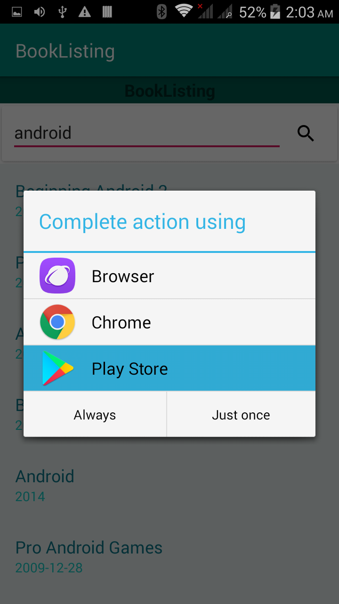

# BookListingApp

An app to learn some phrases and words from english in another language .

# HOW TO RUN

## when you open the app.

## then you search on a word.

## then you click on any result.

# Implementation

the code divided to:

1-front end:

i used only 2 activities one for list-item and othe for activity-main.

2-back end:

i used Adapters, Classes, Loaders and Activites .
